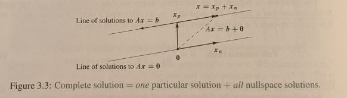

# Introduction to Linear Algebra

## Gilbert Strang

### Chapter 3: Vector Spaces and Subspaces

* The space $R^{n}$ consists of all column vectors $\vec v$ with $n$ components
* If a vector is in a space, it means it can be multiplied by any scalar, or added to any other vector in that space, and the result will stay in that space
  * In other words, all linear combinations of vectors in that space must also remain in that space
* There are spaces other than $R^n$
  * One example is $Z$, the vector space that consists only of the zero vector for a particular $R^n$ (e.g., $Z$ for $R^2$ is $\begin{bmatrix} 0 \\ 0 \end{bmatrix}$)
  * This space is zero dimensional (a point), and is the smallest possible vector space
  * No space can exist without the zero vector as linear combinations of vectors always have the chance to equal zero

#### Subspaces

* Spaces exist _inside_ $R^n$, called subspaces. These contain a subset of all vectors in the full vector space.
* In order to be a subspace, this collection of vectors must: 
  * Contain the zero vector
  * Allow all linear combinations of its members to remain in the space
* Examples of all of the possible subspaces of $R^3$:
  * $L$: A line through $(0, 0, 0)$ (one column vector)
  * $P$: A plane through $(0, 0, 0)$ (two independent column vectors)
  * $R^3$: All of $R^3$ (three independent column vectors)
  * $Z$: The zero vector
* These rules scale to any $R^n$

#### The column space of A

* **If a $A$ matrix is not invertible, it means it is solveable for some $b$ and not others**

* If $Ax = b$ describes these matrices, these $b$'s form a subspace called the column space of $A$, $C(A)$

* In order to describe all of the members of $C(A)$, we multiply $A$ by every possible $x$ 

  * In other words, calculate all possible linear combinations of the column vectors of $A$

* **The system $Ax = b$ is solveable if and only if $b$ is in the column space of $A$**

* If we have an $m \times n$ matrix, our column vectors are in $R^m$ (the number of rows in the matrix), so the linear combinations of the columns in our vector will be a subspace in $R^m$

* For example:

  $Ax = \begin{bmatrix} 1 & 0 \\ 4 & 3 \\ 2 & 3 \end{bmatrix} \begin{bmatrix} x_1 \\ x_2 \end{bmatrix} $  which is (as a linear combination of the vector columns of $A$)  $ x_1\begin{bmatrix} 1 \\ 4 \\ 2 \end{bmatrix} + x_2\begin{bmatrix} 0 \\ 3 \\ 3 \end{bmatrix}$

  * As this is a $3 \times 2$ matrix, we have a column space with two columns in $R^3$
  * As we do not have 3 (independent) column vectors in $C(A)$, this cannot represent all of $R^3$, therefore it is a plane which represents a subspace of $R^3$ 
  * As it has zero thickness, most $b$'s are not in this column space - for most $b$ there is no solution to our three equations in two unknowns

* Rather than starting with a matrix, we could start with some set of vectors $S$ in a vector space

  * $S$ is very likely _not_ a subspace
  * All linear combinations of the vectors in $S$ (called $SS$) are a subspace
  * The subspace $SS$ is the **span** of $S$, containing all combinations of vectors in $S$

#### Nullspaces

* The nullspace $N(A)$ consists of all solutions to $Ax = 0$

  * In the case of invertible matrices, this is only the zero vector $Z$
  * In the case of matrices which contain free variables, the nullspace will contain additional $x$ which solve $Ax = 0$

* The nullspace is a subspace of $R^n$, for any $m \times n$ matrix

* When we create the reduced row echelon form $R$ of any matrix $A$, we discover:

  * Which columns have pivots. The number of pivot columns represents the rank of the matrix $A$, and the dimension of the column space $C(A)$.
  * Which columns are "free" (it does not matter which value we chose for their unknown values). The number of free columns represents the dimension of the nullspace $N(A)$. 
  * The "special solutions", which are vectors in $R^n$ which represent the $x$'s for which $Ax = 0$. These special solutions are the basis of the nullspace, i.e., they are the vectors which, when multiplied by scalars and added, describe all vectors in the nullspace.

* If we start with the matrix $C$:

  $C = \begin{bmatrix} 1 & 2 & 2 & 4 \\ 3 & 8 & 6 & 16 \end{bmatrix}$

  * This matrix has columns 3 and 4 that are multiples of columns 1 and 2

  $U = \begin{bmatrix} 1 & 2 & 2 & 4 \\ 0 & 2 & 0 & 4 \end{bmatrix}$

  * We then reduce this down to $R$

  $R = \begin{bmatrix} 1 & 0 & 2 & 0 \\ 0 & 1 & 0 & 2 \end{bmatrix}$

  * We can now see the first two columns, which are pivot columns, are reduced down to the identity matrix, and the last two give the values needed for the special solutions ($F$).
  * The special solutions are now found by taking each non-zero row of $R$ and representing it in the form $\begin{bmatrix} -F \\ I \end{bmatrix}$
    * This is equivalent to chosing 1 and 0 as the "free" numbers for the special solutions
  * In our case, our special solutions are:

  $s_1 = \begin{bmatrix} 0 \\ -2 \\ 0 \\ 1 \end{bmatrix}, s_2 = \begin{bmatrix} -2 \\ 0 \\ 1 \\ 0 \end{bmatrix}$

* For non-square matrices, the column space and the nullspace lie in different $\mathbb{R}^n$:

  * The column space $C(A)$ lies in $\mathbb{R}^m$, for the number of rows in the matrix
  * The nullspace $N(A)$ lies in $\mathbb{R}^n$, for the number of columns in the matrix

* The rank of a matrix $r$ is the "true dimensionality" of a matrix:

  * It represents the number of pivot columns in the matrix
  * This in practice is the number of independent columns in the matrix
  * The rank gives an indication of the actual number of dimentions that the matrix represents, i.e., if a matrix is $3 \times 3$, but one of the columns is a linear combination of the other 2, then the matrix only has 2 pivot columns, 2 independent columns, and a rank of 2.
    * This means that this matrix will represent a plane subspace within $\mathbb{R}^3$

* Each free column is a combination of earlier pivot columns. The special solutions tell us what those combinations are:

  $A = \begin{bmatrix} 1 & 1 & 2 & 4 \\ 1 & 2 & 2 & 5 \\ 1 & 3 & 2 & 6 \end{bmatrix}, R = \begin{bmatrix} 1 & 0 & 2 & 3 \\ 0 & 1 & 0 & 1 \\ 0 & 0 & 0 & 0 \end{bmatrix}$

  * Column 3 = 2 (column 1) + 0 (column 2), $s_1 = (-2, 0, 1, 0)$
  * Column 4 = 3 (column 1) + 1 (column 2), $s_2 = (-3, -1, 0, 1)$

#### The complete solution to $Ax = b$

* We can go from solving $Ax = 0$ to $Ax = b$ for any matrix

* Remember: if a matrix is not invertible, then $Ax = b$ is not solveable for every $b$

  * It is only solveable for $b$'s that exist in the column space $C(A)$

* In order to check if $Ax = b$ is solveable for any particular $b$, we can create an augmented matrix $\begin{bmatrix} A & b \end{bmatrix} $ and apply elimination (through to the reduced row echelon form)

  * This allows us to see what the dependencies are between the rows of $A$, which the components of $b$ must also satisfy in order to be solveable

  $Ax = b = \begin{bmatrix} 1 & 3 & 0 & 2 \\ 0 & 0 & 1 & 4 \\ 1 & 3 & 1 & 6 \end{bmatrix} \begin{bmatrix} x_1 \\ x_2 \\ x_3 \\ x_4 \end{bmatrix} = \begin{bmatrix} 1 \\ 6 \\ 7 \end{bmatrix} $ has the augmented matrix $\begin{bmatrix} 1 & 3 & 0 & 2 & 1 \\ 0 & 0 & 1 & 4 & 6 \\ 1 & 3 & 1 & 6 & 7 \end{bmatrix} = \begin{bmatrix} A & b \end{bmatrix}$

  * Applying elimination, we end up with:

  $ \begin{bmatrix} R & d \end{bmatrix} = \begin{bmatrix} 1 & 3 & 0 & 2 & 1 \\ 0 & 0 & 1 & 4 & 6 \\ 0 & 0 & 0 & 0 & 0 \end{bmatrix} $

  * The important part of this is the final row, which is equivalent (in the linear equation form) of saying $0 = 0$
    * This *must be true* in order for $Ax = b$ to be solveable for any particular $b$
  * This rule can be seen more clearly with a generalised form of $b$:

  $\begin{bmatrix} A & b \end{bmatrix} = \begin{bmatrix} 1 & 3 & 0 & 2 & b_1 \\ 0 & 0 & 1 & 4 & b_2 \\ 1 & 3 & 1 & 6 & b_3 \end{bmatrix}$ becomes $\begin{bmatrix} 1 & 3 & 0 & 2 & b_1 \\ 0 & 0 & 1 & 4 & b_2 \\ 0 & 0 & 0 & 0 & (b_3 - b_1 - b_2) \end{bmatrix}$

  * Because row 3 is equal to row 1 + row 2 in $A$ (on the "left-hand side" of the linear equations), $b$ can only be solveable if $b_3$ is similarly $b_1 + b_2$, hence $b_3 - b_1 - b_2 = 0$

* Once we know $Ax = b$ is solveable, we can start by finding **one particular solution $Ax = b$**

  * The easiest way to do this is assign the free variables to all equal 0, and then solve for the pivot variables using back-elimination
  * We then have one particular $x_{particular}$ or $x_p$

* The complete solution $x$ for $Ax = b$ is this $x_p$, as well as all of the vectors in the nullspace

  * This is because $A(x_p + x_n) = b + 0 = b$ (because anything plus 0 just equals itself)

* Whether there are multiple solutions for $Ax = b$ depends on the matrix

  * $r = m$ and $r = n$:
    * Full rank (full column rank and full row rank) 
    * Matrix is square and invertible 
    * $Ax = b$ has one unique solution (because nullspace only contains zero vector)
  * $r = m$ and $r < n$:
    * Full row rank
    * Matrix is short and wide
    * $Ax = b$ has $\infty$ solutions (there is always a solution, and nullspace contains non-zero vectors)
  * $r < m$ and $r = n$:
    * Full column rank
    * Matrix is tall and thin
    * $Ax = b$ has either 0 or 1 solutions (the additional rows add more constraints to $b$, meaning not all $b$ will satisfy the row relationships)
  * $r < m$ and $r < n$:
    * Not full rank
    * $Ax = b$ has either 0 or $\infty$ solutions

* When the nullspace contains non-zero vectors, this is what the complete solution is capturing:

  * Say we have 2 equations, $x + y + z = 3$ and $x + 2y - z$ 
    * These are two non-parallel planes in $xyz$ space
    * Because there are only two of them, they will intersect in a **line**, not a **point**
    * This line is what we're trying to find using the particular solution
  * Once we have the particular solution, we can travel along it to find all of the solutions by adding all of the values in the nullspace
    * In this case, the nullspace is also a line, because the rank of the matrix representing these two equations is 2, meaning there is only 1 free variable, meaning the dimension of the nullspace is 1

#### Linear independence

* A sequence of vectors $v_1, v_2, \ldots, v_n$  are linearly independent when the only combination that gives the zero vector is $0v_1, 0v_2, \ldots, 0v_2$
  * In other words, the only vector present in the nullspace is the zero vector
* For example:
  * The vectors $(1, 0)$ and $(0, 1)$ are independent
  * The vectors $(1, 1)$ and $(-1, -1)$ are dependent
  * The vectors $(1, 1)$ and $(0, 0)$ are dependent (the zero vector means that $c = -1$ could give the zero vector)
  * In $\mathbb{R}^2$, any three vectors $(a, b)$, $(c, d)$ and $(e, f)$ are dependent. The linear combinations of two independent vectors already give the entirety of $\mathbb{R}^2$, so a third vector must be a combination of the first two.
* The columns of matrix $A$ are independent exactly when the rank is $r = n$, as there are $n$ pivots and no free variables. This is full column rank.
* If $n > m$ (the number of columns exceeds the number of rows), then the columns cannot be independent. This is because there are $n$ vectors to represent a space in $\mathbb{R}^m$, where $m$ independent vectors would already be enough to span the entirety of $\mathbb{R}^m$. By having $n = m + q$, we have at least $q$ dependent vectors in the column space.

#### Vectors that span a subspace

* A set of vectors **spans** a space if their linear combinations fill the space
  * This does not necessarily mean that they are all independent
* The columns of matrix $A$ span the column space $C(A)$, a subspace in $\mathbb{R}^m$
* The rows of matrix $A$ span the row space, or, more neatly, the column space $C(A^T)$, a subspace in $\mathbb{R}^n$
* **Unless a matrix is symmetric**, the row space and the column space will be different subspaces
* **Unless a matrix is square** ($m = n$), the row space will be in a different $\mathbb{R}^q$ than the column space

#### A basis for a vector space

* A basis is "the right amount" of vectors to both span a space and to be independent
* Once a basis has been discovered, if we have a vector $\vec v$ in a space, there is one, and only one way t write $\vec v$ as a combination of the basis vectors
* However, there are infinitely many bases for a space: as long as they are independent vectors in the space, they will, by their linear combinations, give all vectors in that space
* When we have an invertible matrix, all of the columns are independent
  * Therefore, the vectors $\vec v_1, \ldots, \vec v_n$ are a basis for $\mathbb{R}^n$ exactly when they ae the columns of an $n \times n$ invertible matrix
* When we have a matrix $A$ with dependent columns: 
  * The **pivot columns** form a basis for its column space
  * The **pivot rows** form a basis for its row space
  * The pivot **rows** of its row reduced echelon form $R$ also form a basis for its row space
  * The pivot **columns** of its row reduced echelon form $R$ do **not** form a basis for its column space
    * This is because the operations to obtain $R$ are done on a _row_ level. The relationship between each of the values of the columns (or in other words, the relationship between the multipliers of each unknown $x_n$) are preserved, but not the relationship between each of the linear equations represented by $A$.
* All bases for a vector space contain the same number of vectors
* The dimension of a space is the number of vectors in every basis for that space
  * For a row space and a column space, this is the number of pivot columns
  * For the nullspace of $C(A)$, this is the number of special solutions

#### The four fundamental subspaces of a matrix

* If we have some matrix $A$ of size $m \times n$, we have 4 subspaces
  * Each of these subspaces divide up the entirety of $\mathbb{R}^m$ and $\mathbb{R}^n$
* The four fundamental subspaces are:
  * The row space is $C(A^T)$, a subspace of $\mathbb{R}^n$
  * The column space is $C(A)$, a subspace of $\mathbb{R}^m$
  * The nullspace is $N(A)$, a subspace of $\mathbb{R}^n$
  * The left nullspace is $N(A^T)$, a subspace of $\mathbb{R}^m$
* For the left nullspace, we solve $A^Ty = 0$
  * The vectors $y$ go on the _left_ side of $A$ when the equation is written in the usual "$Ax = 0$" form, hence the name the left nullspace ($y^TA = 0^T$). This is because in the row space, we are trying to find unknowns along the columns of $A$ (or along the rows of $A^T$). This means the dimension of $y$ is $m \times 1$, or the number of rows. This means if we want to multiply $y$ and $A$, we must transpose $y$ and multiply from the left, giving $y^TA = (1 \times m) \times (m \times n)$. Alternatively, we can transpose $A$, giving the more usual form $A^Ty = (n \times m) \times (m \times 1)$
* The four fundamental subspaces are connected in the following ways:
  * For any matrix $A$, the row space and the column space have the same dimension, which is the rank of $A$, $r$
  * $N(A)$ has the dimension $n - r$, meaning that $C(A^T) + N(A)$ makes up the full $\mathbb{R}^n$
  * $N(A^T)$ has the dimension $m - r$, meaning that $C(A) + N(A^T)$ makes up the full $\mathbb{R}^m$

#### The four subspaces for $R$

* Say we have some reduced row echelon form of a matrix $A$:

  $R = \begin{bmatrix} 1 & 3 & 5 & 0 & 7 \\  0 & 0 & 0 & 1 & 2 \\  0 & 0 & 0 & 0 & 0 \end{bmatrix}$

  * For this matrix, $m = 3, n = 5$ and $r = 2$
  * The **row space** of $R$ has dimension 2, matching the rank:
    * The first two rows are a basis, giving combinations of all three rows
    * The third row, being all zeros, adds nothing new
    * Looking at only the pivot columns (1 and 4), we see the identity matrix, meaning there is no way to combine their rows to give the zero row (except by multiplying all values by 0). Therefore these first two rows are independent
    * Therefore, the linear combinations of rows 1 and 2 (the pivot rows) span the entire row space
    * The dimension of the row space is the rank $r$, and the **nonzero rows** of $R$ form a basis (can also use the equivalent rows in $A$ as operations are performed between rows, meaning the rows in $R$ are equivalent to the rows in $A$)
  * The **column space** of $R$ also has the dimension $r = 2$
    * The pivot columns 1 and 4 form a basis for $C(R)$
    * Because they start with the $r \times r$ identity matrix, they are independent, as no combination of these pivot columns can give the zero column except that with all coefficients zero
    * Therefore, these pivot columns form a basis for the column space, and their linear combinations span the column space
  * The **nullspace** of $R$ has the dimensions $n - r = 5 - 2$
    * Because there is a special solution for each of the non-pivot (free) columns, we have 3 columns in the nullspace
    * Because each of these special solutions contain the identity matrix, they are independent
    * Hence, these columns form the basis of the nullspace, and their linear combinations span $N(A)$
    * The special solutions to the nullspace can be derived like so:
      * We take the pivot rows in the pivot columns, giving us column 1 = $\begin{bmatrix} 1 & 0 \end{bmatrix}$ and column 4 = $\begin{bmatrix} 0 & 1 \end{bmatrix}$.
      * We need to construct special solutions of size $n \times 1$, with the first components of columns 1 and 4 inserted in the first component of the special solutions, and the second components of columns 1 and 4 inserted in the fourth component.
      * Because $x_2, x_3$ and $x_5$ are free variables, we replace them with the identity matrix
      * In order to work out how to combine columns 1 and 4, we refer to $R$.
      * Column 2 of $R$ gives us $\begin{bmatrix} 3 & 0 \end{bmatrix}$ in our pivot rows, indicating that we need 3 of column 1 and 0 of column 4 in our first special solution:
        * Special solution 1 = $\begin{bmatrix} -(3 + 0) & 1 & 0 & -(0 + 0) & 0 \end{bmatrix} = \begin{bmatrix} -3 & 1 & 0 & 0 & 0 \end{bmatrix}$
      * Column 3 of $R$ gives us $\begin{bmatrix} 5 & 0 \end{bmatrix}$, indicating that we need 5 of column 1 and 0 of column 4 in our second special solution:
        * Special solution 2 = $\begin{bmatrix} -(5 + 0) & 0 & 1 & -(0 + 0) & 0 \end{bmatrix} = \begin{bmatrix} -5 & 0 & 1 & 0 & 0 \end{bmatrix}$
      * Column 3 of $R$ gives us $\begin{bmatrix} 7 & 2 \end{bmatrix}$, indicating that we need 7 of column 1 and 2 of column 4 in our third special solution:
        * Special solution 3 = $\begin{bmatrix} -(7 + 0) & 0 & 0 & -(0 + 2) & 1 \end{bmatrix} = \begin{bmatrix} -7 & 0 & 0 & -2 & 1 \end{bmatrix}$
  * The **left nullspace** has dimension $m - r = 3 - 2$
    * The equation $R^Ty = 0$ looks for all combinations of the columns of $R^T$ that produce zero
    * For this $R^T$, $y_1$ and $y_2$ must be zero, in order for the right hand side to also equal zero
      * This is because the pivot rows are linearly independent
    * Because the final row is all zeros, the value of $y_3$ is "free", meaning it can be anything
    * Therefore, the left nullspace for this $R$ is the line containing all vectors of the form $\begin{bmatrix} 0 & 0 & y_3 \end{bmatrix}$
    * As such, the dimension of $N(A^T)$ is 1, as this vector is a basis for the entire subspace

#### The four subspaces for $A$

* We must now relate the subspaces of $R$ to those of its original matrix $A$
* $A$ has the same row space as $R$, with the same dimension and the same basis
* The column space of $A$ has dimension $r$, with the column rank equalling the row rank
  * The column space of $R$ is not the same as the column space of $A$
  * However, the same combination of columns is zero (or non-zero) in $A$ and $R$, therefore, the same column **positions** from $R$ can be applied to get the basis of $A$
* $A$ has the same nullspace as $R$, with the same dimension $n - r$ and the same basis
  * Counting Theorem: $r + (n - r) = n$
* The left nullspace of $A$ has the dimension $m - r$
  * The counting theorem for $A^T$ is $r - (m - r) = m$
* The Fundamental Theorem of Linear Algebra, Part 1:
  * The column space and the row space both have dimension $r$
  * The nullspaces have dimensions $n - r$ and $m - r$

#### Rank One Matrices

* If we have a matrix like the one below:

$A = \begin{bmatrix} 2 & 3 & 7 & 8 \\ 2a & 3a & 7a & 8a \\ 2b & 3b & 7b & 8b \end{bmatrix}$

* The row and column ranks of this matrix are 1, because all rows are multiples of the first column, and all columns are multiples of $(1, a, b)$
* As such, the entire matrix $A$ can be represented as:

$A = \begin{bmatrix} 1 \\ a \\ b \end{bmatrix} \begin{bmatrix} 2 & 3 & 7 & 8 \end{bmatrix} = \vec u\vec v^T$

* Now let's say we have a rank two matrix below:

$A = \begin{bmatrix} 1 & 0 & 3 \\ 1 & 1 & 7 \\ 4 & 2 & 20 \end{bmatrix} =  \begin{bmatrix} 1 & 0 & 0 \\ 1 & 1 & 0 \\ 4 & 2 & 1 \end{bmatrix} \begin{bmatrix} 1 & 0 & 3 \\ 0 & 1 & 4 \\ 0 & 0 & 0 \end{bmatrix} = CR$

* Looking at $R$, we can see the basis vectors of the row space are $\vec v_1^T =  \begin{bmatrix} 1 & 0 & 3 \end{bmatrix}$ and $\vec v_2^T =  \begin{bmatrix} 0 & 1 & 4  \end{bmatrix}$
* We can also see that the pivot columns of $R$ are $(1, 0, 0)$ and $(0, 1, 0)$
  * Taking these positions to $A$, we get the basis for the column space $\vec u_1 = (1, 1, 4)$ and $\vec u_2 = (0, 1, 2)$
* In order to get the matrix $A$ from these bases, we multiply the columns from $A$ by the rows in $R$:

$A = \begin{bmatrix} \vec u_1 & \vec u_2 & \vec u_3 \end{bmatrix} \begin{bmatrix} \vec v_1^T \\ \vec v_2^T \\ 0 & 0 & 0 \end{bmatrix} = \vec u_1\vec v_1^T + \vec u_2\vec v_2^T$ = rank 1 + rank 1

* Every rank $r$ matrix is a sum of rank 1 matrices: pivot columns of $A$ times non-zero rows of $R$

